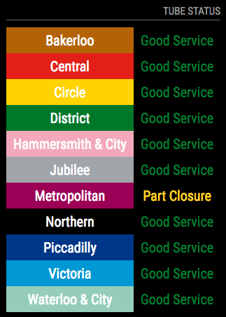

# MMM-Tube-Status


This a module for the [MagicMirror](https://github.com/MichMich/MagicMirror/tree/develop).   This module shows the status of the London Underground.

## Installation
1. Navigate into your MagicMirror's `modules` folder and execute `git clone https://github.com/nigel-daniels/MMM-Tube-Status`.  A new folder `MMM-Tube-Status` will appear, navigate into it.
2. Execute `npm install` to install the node dependencies.

## Config
The entry in `config.js` can include the following options:

|Option|Description|
|---|---|
|`app_id`|**Required (SEE NOTES)** This is the App ID assigned to you on the TfL Open Data Portal.  Details on how to request an App ID can be found [here](https://api-portal.tfl.gov.uk/docs)<br><br>**Type:** `string`<br>|
|`api_key`|**Required (SEE NOTES)** This is the API key assigned to you on the TfL Open Data Portal.  Details on how to request an API key can be found [here](https://api-portal.tfl.gov.uk/docs)<br><br>**Type:** `string`<br>|
|`show_all`|This determines if the module displays all of the tube lines all the time (`true`) or just those currently affected by some sort of outage (`false`).  If this is used and all lines are good then a single line indicates this.<br><br>**Type:** `boolean`<br>**Default value:** true|
|`interval`|How often the tube status is updated.<br><br>**Type:** `integer`<br>**Default value:** `600000 // 10 minutes`|
|'Covid'|This determines whether 'Special Service' is ommitted. Only valid when 'show_all' is 'false'.<br><br> **Type:**'Boolean'<BR> **Default Value:**'false'|

Here is an example of an entry in `config.js`
```
{
    module:		'MMM-Tube-Status',
    position:	'top_left',
    header:		'Tube Status',
    config:		{
                show_all:	 false,
		covid: true
                }
},
```

## Dependencies
- [request](https://www.npmjs.com/package/request) (installed via `npm install`)

## Notes
**IMPORTANT** In this first version, while shown as required, the `app_id` and the `api_key` are unused until I get a response from TfL on how to apply the data limits correctly.  As a result this uses an anonymous request and it is possible this may break after a period of requests.  Again I am awaiting to hear what the request and data limits are so that this can be used correctly.
I hope you like this module, this was built at the request of `djbenny07`on the MagicMirror2 forum.  Feel free to submit pull requests or post issues and I'll do my best to respond.

## Thanks To...
- [Michael Teeuw](https://github.com/MichMich) for the [MagicMirror2](https://github.com/MichMich/MagicMirror/tree/develop) framework that made this module possible.
- [Transport for London](https://tfl.gov.uk) for the guides and information they publish on their API.
